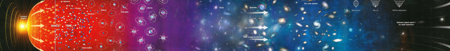

# Física IV B (B5330) - Introducción a Partículas, Astrofísica y Cosmología (B5330, B5297) 

**Asignatura de la carrera de Profesorado en Física [Universidad Nacional de Río Negro](http://www.unrn.edu.ar/ "UNRN")**

**Dr. Hernán Asorey**
***Departamento Física Médica, Centro Atómico Bariloche, Av. E. Bustillo 9500, (8400) San Carlos de Bariloche, Argentina***

## Información importante

Este commit correponde a la última edición del curso, correspondiente a la Cohorte 2022. Para esta edición se ensayó un cambio metodológico basado en el concepto de [aula invertida](https://es.wikipedia.org/wiki/Aula_invertida). Para enfoques previos más tradicionales, recomiendo recomiendo utilizar el release del [curso2021](https://github.com/asoreyh/unrn-f4b/tree/curso2021). Con este commit se da por cerrado el repositorio. 

Todo este material ha sido liberado utilizando una licencia de dominio público creative commons [CC0-1.0-Universal](https://creativecommons.org/publicdomain/zero/1.0/). Por favor revise los [términos de la licencia](#licencia) antes de su uso.

## Objetivos

Adquirir una perspectiva del estado actual de la Física de Partículas, la Astrofísica y la Cosmología, a un nivel introductorio y que produzca las herramientas para su implementación en el aula. Revisar y profundizar algunos de los conceptos desarrollados en Física IA

## Fundamentación

Construir junto con los y las estudiantes aquellos aspectos de la física de partículas, astrofísica y cosmología con el objeto de desarrollar junto a los y las futuros profesores aquellos conocimientos y herramientas que les permitan abordar temas actuales desde un enfoque constructivista en el aula. 
En este curso exploraremos los inicios del universo, su funcionamiento y sus posibles destinos, el modelo estándar de partículas y sus interacciones y el modelo cosmológico.

## Propósitos de la asignatura

Construir juntos los modelos que rigen al universo, y su importancia, y los efectos indirectos que pueden observarse en el mundo cotidiano. Que ustedes comprendan como la física abarca desde los sucesos que rigen las interacciones fundamentales hasta la estructura del Universo a las escalas más grandes, produciendo herramientas para facilitar la implementación en el aula.

## Contenidos mínimos

Los contenidos mínimos establecidos por el [Plan de Estudios vigente de la carrera](https://gitlab.com/asoreyh/unrn-ipac/blob/master/materiales/Plan%20de%20Estudios%20-%20Profesorado%20de%20Ensenanza%20en%20Nivel%20Medio%20y%20Superior%20en%20Fisica%20-%20Sede%20Andina.pdf) para este curso son los siguientes: *Partículas fundamentales y sus interacciones: leptones, hadrones y partículas mensajeras. Antipartículas. El modelo estándar. Aceleradores de partículas. Estrellas y galaxias. Evolución de las estrellas en nacimiento y muerte de las estrellas. Relatividad general: gravedad y la curvatura del espacio. El universo en expansión. El Big-Bang y el fondo cósmico de microondas. El modelo estándar cosmológico. Los primeros tiempos del Universo.*

## Propuesta metodológica

<cite>*"Dime y lo olvido, enseñame y recuerdo, involúcrame y lo aprendo"* -- Xun Kuang, circa -300, compilado en Xunzi, Liu Xiang, circa +820</cite>

<cite>*"...Dime y lo olvido, enseñame y recuerdo, involúcrame y lo aprendo"* -- Ken Bain, What the best college teachers do</cite>

La propuesta metodológica se basa en tres ejes principales que apuntan a favorecer y estimular la realización de un aprendizaje significativo y la interacción entre pares estudiantes y con la cátedra, combinando dos de ellos para estimular el trabajo grupal: clase invertida junto con una adaptación del [aprendizaje basado en retos](https://observatorio.tec.mx/edutrendsabr) y los [entornos de aprendizaje auto-organizados](https://www.educacionresponsable.org/web/contenidos-abiertos/sole-entornos-de-aprendizaje-autoorganizado.html) (self-organizing learning environment, SOLE). Se pueden ver más detalles en la [presentación del curso](encuentros/fisica4b-00-presentacion.pdf).

# Programa

Se ajusta al [Calendario Académico de la UNRN 2022-2023](https://www.unrn.edu.ar/section/47/calendario-academico.html)

## [Programación semanal](encuentros/)

01. 09/Ago: [Exoplanetas](encuentros/fisica4b-01-exoplanetas.pdf)
02. Astrobiología
03. Estrellas
04. Modelo politrópico
05. Fusión estelar
06. Evolución estelar
07. Relatividad general (1ra parte) y objetos compactos
08. Galaxias y la estructura a gran escala del universo
09. Antimateria y leptones
10. Interacción fuerte
11. Interacción débil
12. Modelo estándar 
13. Relatividad general (2da parte) y el universo en expansión
14. Fondo cósmico de microondas y el modelo cosmológico estándar
15. Bariogénesis e historia térmica del universo.
16. Revisión del curso y cierre

## Bibliografía complementaria

* An Introduction to Modern Astrophysics; Carrol Bradley and Ostille Dale; 2nd Edition; Addison Wesley; 2006; ISBN 9780805304022
* Introduction to Elementary Particles; David Griffiths; 2nd Revised Edition; Wiley-VCH; 2008; ISBN 9783527406012
* El Significado de la Relatividad; Albert Einstein; S.L.U. Espasa; 1921; ISBN 9788467029710
* Física Universitaria Vol 2, Cap 37; Hugh Young y Roger Freedman (Sears y Semansky); 13ma Edición; Addison Wesley; 2015; ISBN 9786073221245
* The Nature of Space and Time; Stephen Hawkings and Roger Penrose; Princeton University Press; 2010; ASIN: 
* Breve Historia del Tiempo; Stephen Hawkings; Paidos; 1988; ISBN 9786079377373
* Física de las noches estrelladas: Astrofísica, Relatividad y Cosmología; Eduardo Battaner; Tusquets Editores; 2011; ISBN: 9788483833421
* ¿Qué es la vida?; Erwin Schrödinger; Salamanca; 2005.
* Juego [A slower speed of light](http://gamelab.mit.edu/games/a-slower-speed-of-light/), una visión de como se vería el mundo a velocidad cercanas a la velocidad de la luz; MIT Game Lab; 2013
* [Stellarium](https://stellarium.org/es/), un planetario de código abierto, multiplataforma y gratuito, 2019

### Horarios encuentros sincrónicos:
* Todos los martes a las 15:00.

# Sobre las clases:

Las clases fueron realizados en [LibreOffice Impress](https://es.libreoffice.org/descubre/impress/), la herramienta de presentaciones de [LibreOffice](https://es.libreoffice.org/). Para poder visualizar correctamente las clases, por favor descárguelo siguiendo este enlace: **[Descargue LibreOffice](https://es.libreoffice.org/descarga/libreoffice-estable/)**. En Windows, puede ser necesario descargar también la fuente [Cabin](https://www.fontsquirrel.com/fonts/download/cabin). Para facilitar la difusión, se incluyen también versiones de las clases en formato pdf. Para visualizarlo, podría necesitar descargar [Acrobat Reader](https://get.adobe.com/es/reader).

# Licencia

**Física IV B (IPAC: Introducción a Partículas, Astrofísica y Cosmología)**, (c) por Hernán Asorey, 2016, 2017, 2018, 2019, 2020, 2021, 2022.
 
<a property="dct:title" rel="cc:attributionURL" href="https://github.com/asoreyh/unrn-f4b/">Introducción a Partículas, Astrofísica y Cosmología (IPAC - Física IV B - UNRN - B5330, B5297)</a> by <a rel="cc:attributionURL dct:creator" property="cc:attributionName" href="https://github.com/asoreyh/">Hernán Asorey</a> is marked with <a href="https://creativecommons.org/publicdomain/zero/1.0/?ref=chooser-v1" target="_blank" rel="license noopener noreferrer" style="display:inline-block;">CC0 1.0 Universal</a>.

